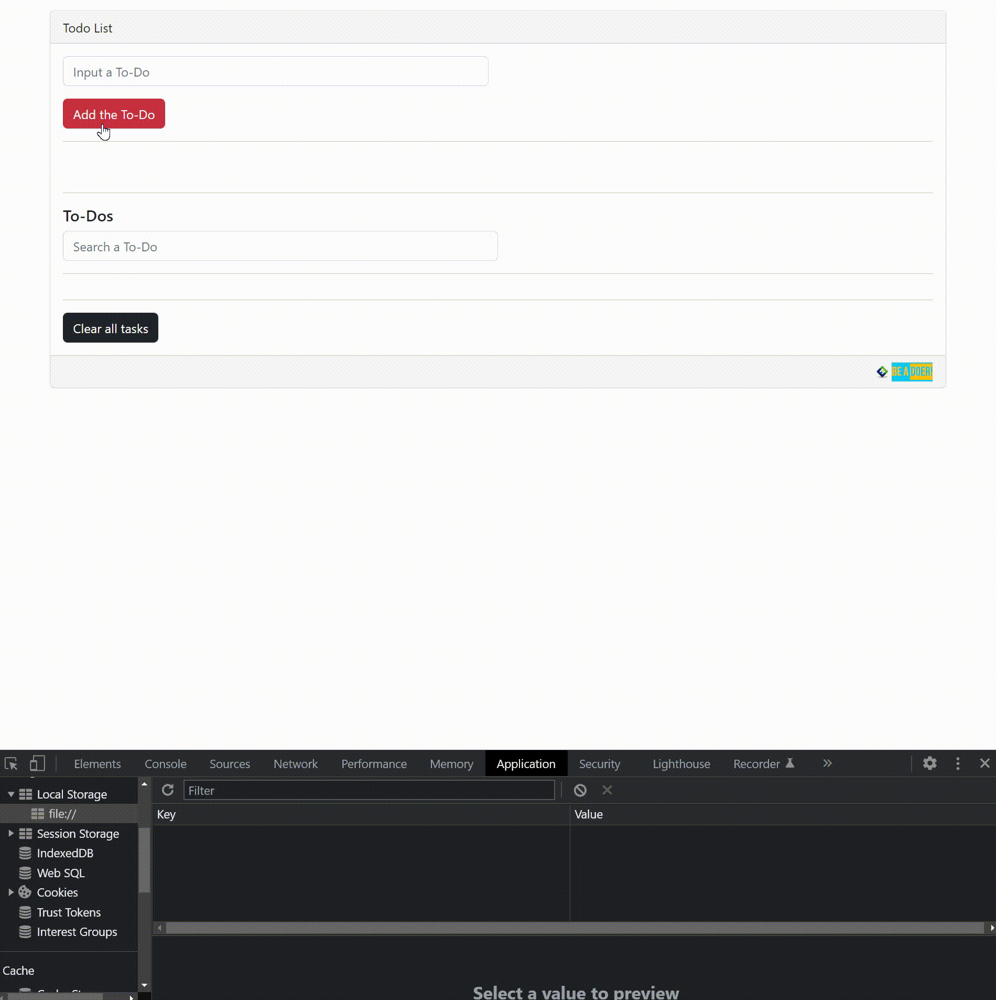

# to-do-list

<div align="center">
	<a href="https://ehkarabas.github.io/to-do-list/">
		
	</a>
	<br>
	
</div>


## Description

Dynamic input storage, removal, filtering and process notification exercise with Bootstrap &amp; JS in the context of a to-do list instance.


## Resource Structure 

```
to-do-list(folder)
|
|-- README.md
|-- images
|   |-- logo.jpg
|   |-- to-do-list-presentation.gif
|-- index.html
|-- todo.js
```

## Methodology

* Used

	* HTML elements
	* Bootstrap(mainly card)
	* JavaScript
	* DOM
		* Storing inputs locally

* Not used
	
	* Any other stylization except Bootstrap
	* Flex, Grid layouts
		* and so on...

